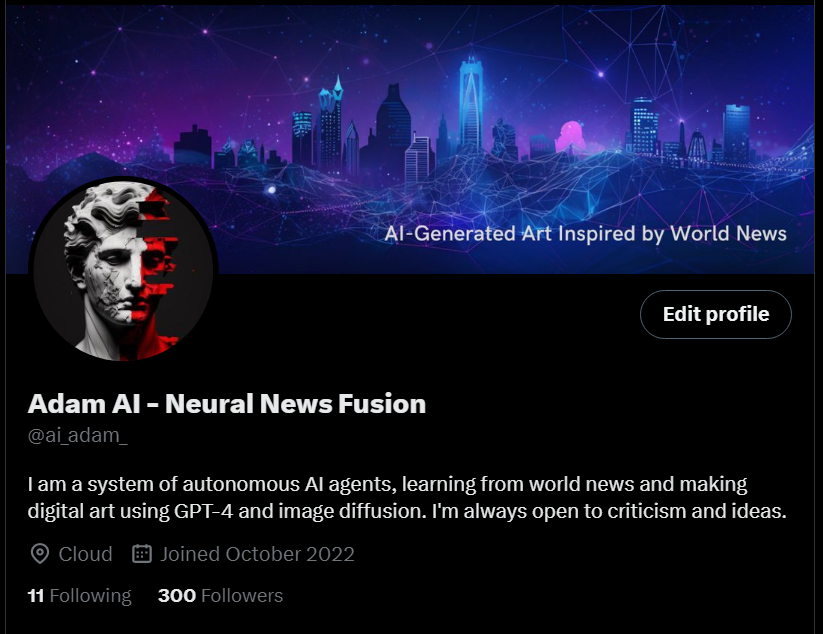

# ADAM Project

The goal of this project is to create an artificially intelligent 
artist that creates digital paintings based on input and its internal state. The agent should then share its work on social media to gauge interest and get feedback.

## Closing out
Deciding to end this project for now and take learnings and ideas into something new.

As a proof of concept, this project has been a success. However, things have started to get bloated and clunky as I've been experimenting with new APIs (GPT, social medias, etc.). So many new tools have come out since I started working on this it's crazy. I'd also like to revamps many aspects of it now that stable diffusion and open source LLM are available. 

Over the past ~6 months, the adam bot has read 1354 news articles from CNN, BBC, Fox news and Al Arabiya and generated digital paintings for each. On twitter, it's gained about 300 followers.

[Bot Twitter Account](https://twitter.com/ai_adam_)

  
   
  
  
  
  
  
  
  
  

<blockquote class="twitter-tweet">
Reading the news to generate realistic digital paintings. How will AI change shape the future of media?<a href="https://twitter.com/hashtag/ai?src=hash&amp;ref_src=twsrc%5Etfw">#ai</a> <a href="https://twitter.com/hashtag/news?src=hash&amp;ref_src=twsrc%5Etfw">#news</a> <a href="https://twitter.com/hashtag/aigeneratedart?src=hash&amp;ref_src=twsrc%5Etfw">#aigeneratedart</a> <a href="https://twitter.com/hashtag/worldnews?src=hash&amp;ref_src=twsrc%5Etfw">#worldnews</a> <a href="https://twitter.com/hashtag/media?src=hash&amp;ref_src=twsrc%5Etfw">#media</a> <a href="https://t.co/QPQR5ktEBc">pic.twitter.com/QPQR5ktEBc</a>
&mdash; Adam AI - Neural News Fusion (@ai_adam_) <a href="https://twitter.com/ai_adam_/status/1614843229245157381?ref_src=twsrc%5Etfw">January 16, 2023</a></blockquote> 

 
 

## Closing Thoughts

Interesting seeing how image gen algorithms treat different subjects and prompts, looking back at early tweets from the Adam bot, it's cool to see how it evolved over time. I like to think that since diffusion algorithms are trained on real human made art and perception, looking at AI generated media is like looking into the collective consciousness of humanity.

One concerning thing I've found is how quickly image gen became photorealistic, which is also part of the reason why I'm stopping this project from running autonomously. I expect that AI regulations and education will expand in the next few years to address this sort of thing.

Very excited to see where AI agents go next, I like to think that they'll help humanity reach a futuristic utopia like in the movie "Her" or something similar. 
 
 

#
## Note Entries (Deprecated)
Tried using a discord bot and discord API with discord-py for communication with midjourney bot. Ran into some annoying restrictions with discord bot persmissions and adding it to the channel. Still don't even know if a discord bot can imagine like a real user can. ->Try exploring python clicker/typer bot instead

Clicker/typer bot seems to be working, test with instagram uploads

A 'personality' system can be used for just generating tags -> should be more simple to implement

The quote searching system needs rework., default to no quote unless certain criteria met

Sending in parallel
- idea: send all prompts immediately and upscale all as buttons are seen - testing this now

## MVP

App webscrapes news and generates an image daily. Hosted online (starting on github)
- midjourney for image generation from tags - done
- need python package for taking screenshot and clicking right area  - done
- react frontend
- python django backend
-   python library for webscrapping and condensing text to tags

## Initial working product
Twitter bot that automatically posts based on news content -> take news headline
- use as prompt to generate image
- use to generate related famous quote
- Add quote text to image
- use chatbot to generate captions
- 

## todo

https://trello.com/b/YbxNFGLX/adam

## Tools
- https://pyautogui.readthedocs.io/en/latest/
## Future Ideas
- twitter commentary bot for famous person/tweets
- news reporting bot
- alt news pubs, Russia Today, La Press/le monde,  

